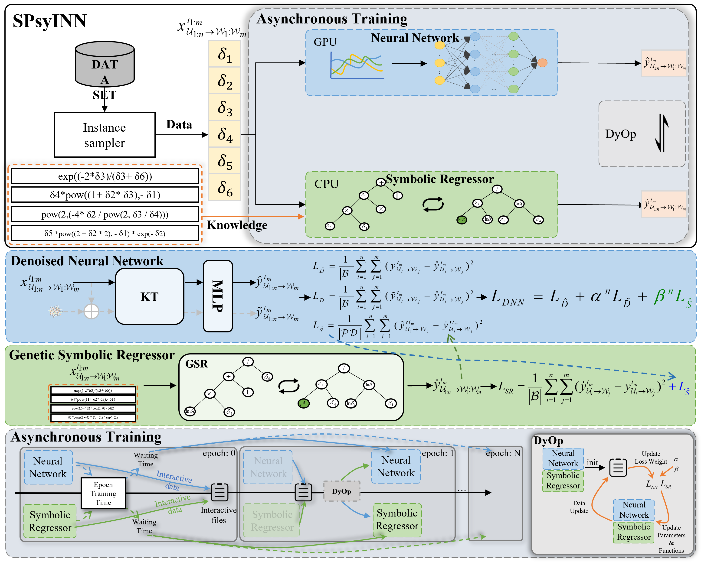

# SPsyINN：Combining Denoised Neural Network and Genetic Symbolic Regression for Memory Behavior Modeling via Dynamic Asynchronous Optimization



**SPsyINN** is a novel neural network method that integrates data and knowledge, significantly enhancing the modeling of learners’ memory processes through knowledge injection. We demonstrated that **dynamic asynchronous optimization** is effective in resolving interaction challenges between neural networks and symbolic regression. In practical applications, SPsyINN uncovered memory equations consistent with classical theories while revealing the dual influence of time intervals and learners’ historical behaviors, offering valuable insights for memory modeling.

In summary, we have, for the first time, integrated machine learning with cognitive science, providing a psychologically interpretable dynamic asynchronous training model that opens new possibilities for personalized education and the discovery of memory laws.

---
## Dataset

The `.zip` files in the `dataset` directory contain the data required for training. These files need to be extracted into the `dataset` directory.
- To facilitate the validation of symbolic regression, we have organized the corresponding data into CSV files stored in the `dataset(csv)` directory. You need to extract the compressed files in this directory.
- The data includes (clearly labeled in the CSV files):
  - $\delta_{1:6}$: Represents user memory features. In the Duolingo, En2De and En2Es dataset, $\delta_{1:6}$ is intact. However, in the MaiMemo dataset, $\delta_3$ was not available, so we retained only $\delta_1, \delta_2, \delta_4, \delta_5, \delta_6$.
  - $Recall$: Represents memory states.

## Project Execution

## Quick Start
### Environment Configuration
```bash
conda create -n spsyinn python=3.8
conda activate spsyinn
pip install -r requirements.txt


Our project is straightforward to implement. You can execute the `./trainer/run.py` script to run the project. 

**Note:** You need to extract the `.zip` files in the `dataset` directory before running the script.

## Configuration Details
The configuration details are located in the `model/Constants.py` file. In this file, you can modify various parameters:

- **Training dataset**
- **LSTM configuration** in the Denoised Neural Network (DNN)
- **Training strategies**
- Enabling or disabling **Dynamic Asynchronous Optimization (DAO)**
- Initialization equations for **Genetic Symbolic Regression (GSR)**
- settings like the number of iterations and population size for GSR

## Training Details

- **DNN training** specifics are located in `trainer/TorchModel_train.py`.
- **GSR training** specifics can be found in `trainer/GPSR_train.py`.

## For Functions performance

We have configured corresponding methods to evaluate equation performance in the `Test for functions` directory for your convenience.
