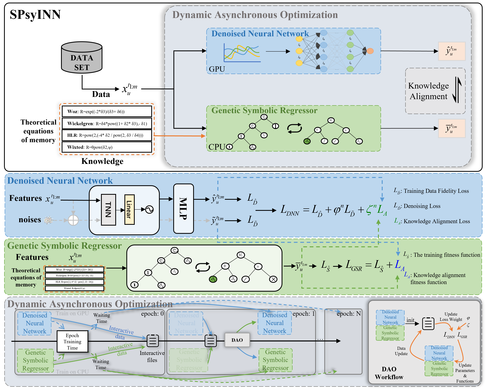

# SPsyINN：Combining Denoised Neural Network and Genetic Symbolic Regression for Memory Behavior Modeling via Dynamic Asynchronous Optimization



**SPsyINN** is a novel neural network method that integrates data and knowledge, significantly enhancing the modeling of learners’ memory processes through knowledge injection. We demonstrated that **dynamic asynchronous optimization** is effective in resolving interaction challenges between neural networks and symbolic regression. In practical applications, SPsyINN uncovered memory equations consistent with classical theories while revealing the dual influence of time intervals and learners’ historical behaviors, offering valuable insights for memory modeling.

In summary, we have, for the first time, integrated machine learning with cognitive science, providing a psychologically interpretable dynamic asynchronous training model that opens new possibilities for personalized education and the discovery of memory laws.

<pre> ```bibtex @inproceedings{sun2025, author = {Sun, Jianwen and Chen, Qirong and Huang, Zhenya and Hu, Zhihai and Liang, Ruxia and Shen, Xiaoxuan}, title = {Combining Denoised Neural Network and Genetic Symbolic Regression for Memory Behavior Modeling via Dynamic Asynchronous Optimization}, booktitle = {Proceedings of the 31st ACM SIGKDD Conference on Knowledge Discovery and Data Mining V.2}, year = {2025}, pages = {2735--2746}, publisher = {Association for Computing Machinery}, address = {New York, NY, USA}, doi = {10.1145/3711896.3736886}, url = {https://doi.org/10.1145/3711896.3736886}, keywords = {cognitive psychology, genetic symbolic regression, knowledge-informed neural networks, memory behavior modeling} } ``` </pre>
